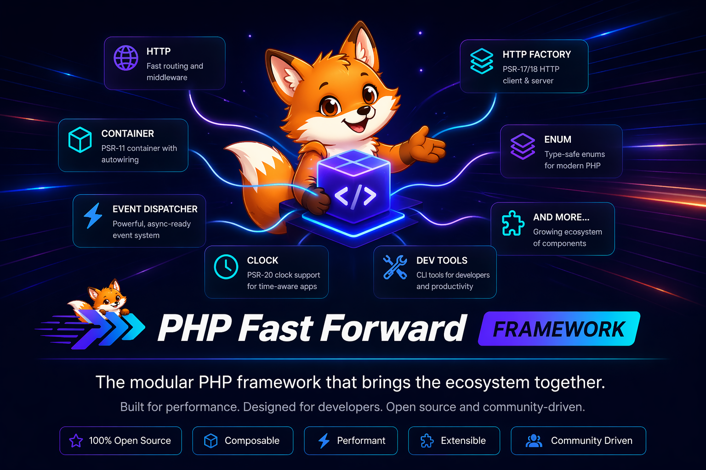

Getting Started
==============

This section helps you move from installation to a working container bootstrap as quickly
as possible.

If you are evaluating the package for the first time, read the pages in this order:

1. ``installation`` to understand what the metapackage installs.
2. ``quickstart`` to wire the ``FrameworkServiceProvider`` into a real container.

.. toctree::
   :maxdepth: 1

   installation
   quickstart

Learn more in the main links section for dependency and report references before you
start production wiring.
